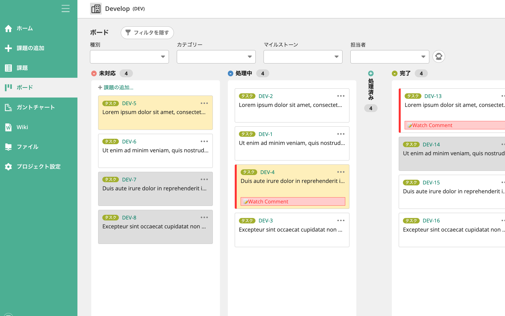

# Backlog Enhancer

## Overview

Backlogのボード表示を強化するChrome拡張



## Features

- 優先度の色付け
- ウォッチリストに登録したコメントの表示
- 長い課題タイトルの省略表記
- レーン（列）の開閉

## Installation

```
npm install
```

## Build

```
npm run build
```